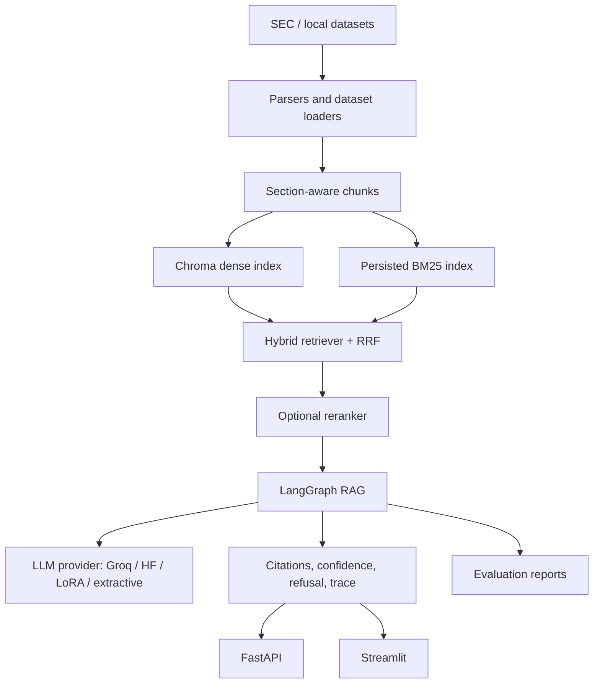

# Financial Document Intelligence RAG

An AI engineering project for financial filing ingestion, indexing, retrieval-augmented generation, evaluation, and local demo workflows.

This repository is intentionally honest about data availability. It can run locally in demo/extractive mode, but real SEC filings, benchmark datasets, API keys, and LoRA adapters must be ingested or configured before the app reports production metrics.

## What Is Implemented

- SEC EDGAR ingestion for 10-K, 10-Q, and 8-K filings with SEC User-Agent, rate limiting, raw filing storage, and filing manifests.
- SEC parsing, table extraction, section-aware chunking, and processed chunk export to Parquet/JSONL.
- Optional dataset loaders for Financial PhraseBank, FiQA, FinanceBench, TAT-QA, FinQA, and local Kaggle/Finnhub SEC files.
- Dense ChromaDB indexing and persisted BM25 indexing under `data/indexes/`.
- Hybrid retrieval with Reciprocal Rank Fusion, metadata filters, configurable `top_k`, optional multi-query, and optional reranking.
- Actual LangGraph RAG workflow using `StateGraph`, node-level trace output, conditional routing, confidence scoring, citations, and refusal behavior.
- LLM provider abstraction for Groq, HuggingFace, local LoRA, and explicit extractive fallback.
- LoRA dataset building, training/evaluation entrypoints, and honest “not trained yet” reporting when adapters are missing.
- FastAPI backend with health, readiness, metrics, ingestion jobs, index rebuild jobs, query, compare, temporal, evaluate, reports, and document search endpoints.
- Streamlit UI pages for chat, ingestion, dataset/chunk exploration, comparison, temporal analysis, evaluation, LoRA status, and system health.
- Docker, Docker Compose, Makefile, CI, pre-commit config, deployment docs, and tests.

## Dataset Sources

- SEC EDGAR filings: downloaded by `scripts/ingest_sec.py`.
- Kaggle/Finnhub SEC filings: load from local files under `data/raw/kaggle/`.
- Financial PhraseBank: loaded through HuggingFace datasets when internet is available.
- FiQA / BEIR-FiQA: loaded through HuggingFace datasets when internet is available.
- FinanceBench, TAT-QA, FinQA: load from local JSON/JSONL/CSV files under `data/raw/financebench/`, `data/raw/tatqa/`, and `data/raw/finqa/`.

If a dataset is unavailable, loaders fail with a clear message. They do not create fake rows.

## Commands

```bash
pip install -r requirements.txt
cp .env.example .env
```

Ingest SEC filings:

```bash
python scripts/ingest_sec.py --tickers AAPL MSFT TSLA NVDA JPM AMZN GOOGL META AMD NFLX --forms 10-K 10-Q 8-K --start-year 2020 --end-year 2025 --limit-per-company 20
```

Prepare optional datasets:

```bash
python scripts/prepare_datasets.py
python scripts/prepare_datasets.py --demo-ok
```

Build indexes:

```bash
python -m src.indexing.build_indexes --rebuild
```

Evaluate:

```bash
python scripts/evaluate.py --eval-set demo --retriever hybrid_rerank --llm extractive --output reports/evaluation_latest.json
```

Train/evaluate LoRA:

```bash
python src/finetuning/build_lora_dataset.py
python src/finetuning/train_lora.py
python src/finetuning/evaluate_lora.py
```

Run API/app:

```bash
uvicorn api:app --reload
streamlit run app.py
```

## Architecture



## Metrics

No benchmark numbers are hardcoded in this README. Latest metrics are shown only if generated report files exist:

- `reports/evaluation_latest.json`
- `reports/retrieval_ablation.csv`
- `reports/lora_eval_results.json`
- `reports/model_comparison.csv`

If metrics are absent, run:

```bash
python scripts/evaluate.py --eval-set demo --retriever hybrid_rerank --llm extractive --output reports/evaluation_latest.json
```

## Deployment

See `README_DEPLOYMENT.md`.

```bash
docker compose up --build
```

## Verification

```bash
python -m pytest
python scripts/build_dataset_card.py
python scripts/evaluate.py --eval-set demo --retriever hybrid_rerank --llm extractive --output reports/evaluation_latest.json
```

The extractive provider is a labeled fallback. Real Groq/HuggingFace generation requires API keys. LoRA dashboards show “not trained yet” unless an adapter/report exists.
