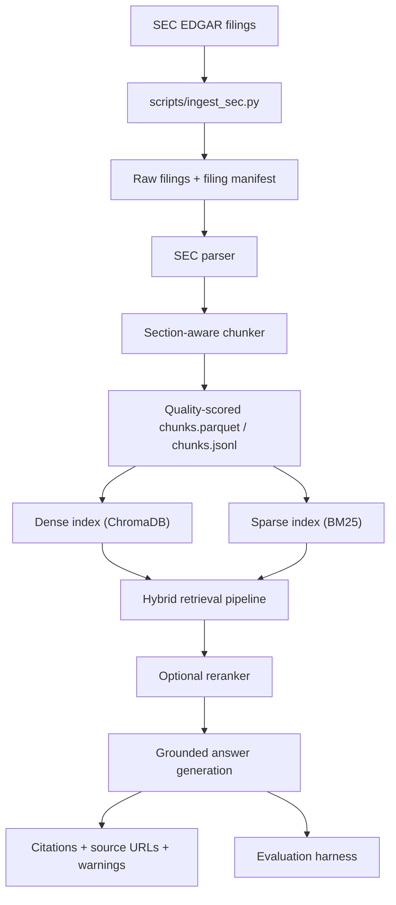

# Financial Document Intelligence RAG

Financial Document Intelligence RAG is a reproducible SEC filing pipeline for ingesting real EDGAR filings, extracting section-aware chunks, building dense and sparse indexes, retrieving grounded evidence, and generating cited answers with honest no-answer handling. The repository is designed to be inspectable end to end: every stage has verification scripts, evaluation reports, and local commands that rebuild the corpus and indexes from source filings rather than relying on demo-only placeholders.

From an engineering and product perspective, this project tackles a practical problem: financial question-answering systems are only useful if they can show their evidence, preserve filing metadata, and fail honestly when the corpus does not support the question. This codebase emphasizes reproducibility, metadata fidelity, and evaluation discipline over flashy but unverifiable outputs.

## Why This Project Matters

- Financial document QA is high-stakes: answers need citations, source URLs, and provenance.
- SEC filings are noisy HTML documents with difficult section boundaries, boilerplate, and tables.
- Retrieval quality depends on more than embeddings alone; sparse search, chunk quality, reranking, and filters all matter.
- An honest system must support abstention when the answer is not grounded in the indexed corpus.

## Key Features

- Real SEC EDGAR ingestion for `10-K` and `10-Q` filings with manifest generation.
- Section-aware parsing and chunking with quality metadata:
  - `is_toc_like`
  - `boilerplate_score`
  - `content_quality_score`
  - `section_confidence`
- Dense ChromaDB index and persisted BM25 index built from the same chunk corpus.
- Hybrid retrieval with dense search, BM25, reciprocal rank fusion, metadata filters, and optional reranking.
- Grounded answer generation with SEC citations, source URLs, and deterministic extractive fallback.
- Honest no-answer handling for unsupported topics and out-of-range years.
- Evaluation harness with retrieval, citation, grounding, and latency metrics.
- Verification scripts for dependencies, dataset, chunk quality, indexes, retrieval, answering, evaluation, and docs.

## Current Verified Snapshot

The latest local verification snapshot for the real SEC corpus is:

| Metric | Value |
| --- | ---: |
| Companies | `5` |
| Filings | `40` |
| Chunks | `14,019` |
| Dense index count | `14,019` |
| BM25 index count | `14,019` |
| `keyword_hit_rate` | `0.500` |
| `citation_coverage` | `0.926` |
| `source_url_coverage` | `1.000` |
| `weak_evidence_rate` | `0.222` |
| `no_answer_handling` | `1.000` |
| `latency_ms_avg` | `3944.30` |
| Pytest | `70 passed` |

These numbers come from the generated evaluation artifacts under [reports](/F:/financial-document-intelligence-rag-master/financial-document-intelligence-rag-master/reports) and the local verification flow documented below.

## Architecture Overview



See [docs/architecture.md](/F:/financial-document-intelligence-rag-master/financial-document-intelligence-rag-master/docs/architecture.md) for the detailed system flow.

## Dataset Details

The verified corpus is built from real SEC filings for:

- `AAPL`
- `MSFT`
- `TSLA`
- `NVDA`
- `JPM`

Coverage:

- Forms: `10-K`, `10-Q`
- Filing years: `2022` through `2024`
- Filings ingested: `40`
- Chunk count after quality filtering: `14,019`

Each chunk preserves the core metadata needed for retrieval and attribution:

- `ticker`
- `company`
- `form_type`
- `filing_date`
- `fiscal_year`
- `fiscal_period`
- `section`
- `accession_number`
- `source_url`

## Pipeline Stages

1. **Ingestion**  
   Download real SEC filings and build a filing manifest.
2. **Parsing**  
   Extract filing text and section candidates from SEC HTML.
3. **Chunking**  
   Split filings into section-aware chunks and attach quality metadata.
4. **Indexing**  
   Build Chroma dense vectors and persisted BM25 sparse data structures.
5. **Retrieval**  
   Run dense + BM25 search, fuse results, apply filters, and optionally rerank.
6. **Answering**  
   Generate grounded answers from retrieved evidence only, with citations.
7. **Evaluation**  
   Measure retrieval relevance, citation coverage, no-answer handling, and latency.

## Tech Stack

- Python 3.11
- SEC EDGAR ingestion via HTTP + rate-limited local scripts
- `pandas` / `pyarrow` for tabular datasets
- ChromaDB for dense vector persistence
- BM25 via `rank_bm25` with compact local persistence
- Sentence Transformers for embeddings and optional reranking
- Deterministic extractive fallback for local no-key operation
- `pytest` for verification and regression coverage

## Setup

PowerShell commands:

```powershell
python -m venv .venv
.\.venv\Scripts\Activate.ps1
python -m pip install --upgrade pip
pip install -r requirements.txt
Copy-Item .env.example .env
```

Then edit `.env` and set at minimum:

```dotenv
SEC_EDGAR_USER_AGENT=Your Name your_email@example.com
LLM_PROVIDER=extractive
CHROMA_PERSIST_DIR=./data/indexes/chroma
```

## Environment Variables

Common variables used in the verified pipeline:

| Variable | Required | Purpose |
| --- | --- | --- |
| `SEC_EDGAR_USER_AGENT` | Yes | Required by SEC EDGAR requests. |
| `LLM_PROVIDER` | Recommended | Set to `extractive` for local reproducibility without paid APIs. |
| `GROQ_API_KEY` | Optional | Enables Groq-backed answer generation. |
| `HF_TOKEN` | Optional | Enables Hugging Face provider access. |
| `HUGGINGFACEHUB_API_TOKEN` | Optional | Alternate Hugging Face auth variable. |
| `EMBEDDING_MODEL_ID` | Optional | Dense embedding model, default `all-MiniLM-L6-v2`. |
| `RERANKER_MODEL_ID` | Optional | Cross-encoder reranker model id. |
| `CHROMA_PERSIST_DIR` | Optional | Dense index persistence directory. |
| `LOG_LEVEL` | Optional | Logging verbosity. |

For deterministic local tests, the repo also supports:

```powershell
$env:RERANKER_MODE="fallback"
```

## Reproducible Commands

These are the core rebuild commands for the verified SEC pipeline:

```powershell
python scripts/ingest_sec.py --tickers AAPL MSFT TSLA NVDA JPM --forms 10-K 10-Q --start-year 2022 --end-year 2024 --limit-per-company 8
python scripts/verify_dataset.py
python scripts/build_indexes.py
python scripts/verify_indexes.py
python scripts/verify_retrieval.py
python scripts/verify_answering.py
python scripts/run_evaluation.py
python scripts/verify_evaluation.py
python -m pytest -q --basetemp=.pytest-tmp-project-polish
```

See [docs/reproducibility.md](/F:/financial-document-intelligence-rag-master/financial-document-intelligence-rag-master/docs/reproducibility.md) for a step-by-step rebuild checklist.

## Demo Commands

Retrieve evidence:

```powershell
python scripts/query_retrieval.py "What are Apple's main risk factors?" --ticker AAPL --section "Risk Factors" --top-k 5
python scripts/query_retrieval.py "What does Microsoft say about revenue?" --ticker MSFT --form-type 10-K --top-k 5
```

Generate grounded answers:

```powershell
python scripts/query_answer.py "What are Apple's main risk factors?" --ticker AAPL --section "Risk Factors" --top-k 5
python scripts/query_answer.py "What does Nvidia say about dividend policy in these filings?" --ticker NVDA --top-k 5
```

The second query is a useful no-answer demo: the system should return `insufficient_evidence` rather than fabricating a dividend-policy answer.

## Evaluation Metrics

| Metric | Current value |
| --- | ---: |
| `top_k_ticker_match` | `1.000` |
| `expected_section_match` | `1.000` |
| `expected_form_type_match` | `1.000` |
| `keyword_hit_rate` | `0.500` |
| `citation_coverage` | `0.926` |
| `source_url_coverage` | `1.000` |
| `weak_evidence_rate` | `0.222` |
| `no_answer_handling` | `1.000` |
| `latency_ms_avg` | `3944.30` |

Interpretation:

- Retrieval filters and attribution are strong.
- Citation coverage is high and source URLs are complete.
- No-answer handling is working correctly.
- Keyword hit rate still leaves room for retrieval and synthesis improvement.
- End-to-end latency is usable for local demos but can be improved further.

More detail is documented in [docs/metrics.md](/F:/financial-document-intelligence-rag-master/financial-document-intelligence-rag-master/docs/metrics.md).

## Example Question / Answer Output

Example command:

```powershell
python scripts/query_answer.py "What are Apple's main risk factors?" --ticker AAPL --section "Risk Factors" --top-k 5
```

Representative output shape:

```text
question: What are Apple's main risk factors?
grounding_status: grounded_with_warnings
used_provider: extractive

answer:
Based on the retrieved SEC filings:
- Apple describes risks tied to competitive pressure, legal and regulatory challenges, and returns on capital. [Source 3]
- The filings also discuss exposures related to liquidity, credit deterioration, market conditions, and political risk. [Source 5]
- Apple cites payment-card security and related operational issues as risks that could materially affect the business. [Source 2]

[Source 2] https://www.sec.gov/Archives/edgar/data/320193/000032019323000106/aapl-20230930.htm
[Source 3] https://www.sec.gov/Archives/edgar/data/320193/000032019323000106/aapl-20230930.htm
[Source 5] https://www.sec.gov/Archives/edgar/data/320193/000032019323000106/aapl-20230930.htm
```

## Repo Structure

```text
api.py                      FastAPI entrypoint
app.py                      Streamlit entrypoint
scripts/                    Rebuild, verification, and CLI query scripts
src/data/                   SEC ingestion, parsing, chunking
src/embeddings/             Dense and sparse indexing modules
src/retrieval/              Hybrid retrieval, reranking, confidence logic
src/answering/              Grounded answer generation
src/evaluation/             Evaluation dataset runner and metrics
reports/                    Generated summaries and verification artifacts
docs/                       Architecture, quickstart, demo, metrics, limitations
tests/                      Unit and integration coverage
```

## Testing

Run the project-docs verification:

```powershell
python scripts/verify_project_docs.py
```

Run the test suite:

```powershell
python -m pytest -q --basetemp=.pytest-tmp-project-polish
```

Core smoke-test scripts:

```powershell
python scripts/verify_dataset.py
python scripts/verify_chunk_quality.py
python scripts/verify_indexes.py
python scripts/verify_retrieval.py
python scripts/verify_answering.py
python scripts/verify_evaluation.py
```

## Troubleshooting

### Windows pytest temp folder permissions

If pytest fails with an access error on an old temp directory such as `.pytest-tmp-*`, use a fresh temp path:

```powershell
python -m pytest -q --basetemp=.pytest-tmp-project-polish-run2
```

The repository has previously hit a stale Windows permission lock on reused pytest temp folders. Using a fresh `--basetemp` is the safest local workaround.

### SEC ingestion fails immediately

- Confirm `SEC_EDGAR_USER_AGENT` is set in `.env`.
- Use a real name and email format accepted by SEC EDGAR.

### Dense index import issues

- Re-run `python scripts/verify_dependencies.py`.
- Confirm Chroma/OpenTelemetry imports succeed before rebuilding indexes.

### Missing indexes

- Run `python scripts/build_indexes.py`.
- Then verify with `python scripts/verify_indexes.py`.

## Current Limitations

- SEC filing HTML is difficult to parse perfectly across issuers and years.
- Financial tables are preserved as text but not deeply modeled as structured table objects.
- Extractive fallback is weaker than a strong external LLM provider.
- `keyword_hit_rate` is improved but still not where it could be.
- The evaluation set is intentionally small and curated.
- Local latency can still be improved, especially with reranking enabled.
- The repository does not yet include a production deployment path in this polishing step.

See [docs/known_limitations.md](/F:/financial-document-intelligence-rag-master/financial-document-intelligence-rag-master/docs/known_limitations.md) for the detailed limitations list.

## Future Improvements

- Better modeling of financial tables and note relationships.
- More targeted retrieval features for year-specific and comparison questions.
- Larger and more adversarial evaluation sets.
- Faster reranking and lower end-to-end latency.
- Stronger generative synthesis when an external provider is configured.

