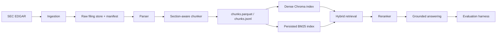

# Architecture

## System Overview

This project is a local-first financial document intelligence pipeline built around real SEC filings. The system takes raw EDGAR documents through ingestion, parsing, chunking, dense and sparse indexing, hybrid retrieval, grounded answer generation, and offline evaluation. Each major stage has a verification script so the pipeline can be inspected and reproduced without relying on hidden services.

## High-Level Flow

## Data Ingestion Flow

Entry point: [scripts/ingest_sec.py](/F:/financial-document-intelligence-rag-master/financial-document-intelligence-rag-master/scripts/ingest_sec.py)

Responsibilities:

1. Accept ticker, form, year, and per-company limits.
2. Download real filings from SEC EDGAR using a configured SEC-compliant user agent.
3. Persist raw filing artifacts locally under ignored data directories.
4. Write a filing manifest in CSV and Parquet form.
5. Surface exact download errors instead of silently substituting fake or demo rows.

Primary outputs:

- `data/processed/filing_manifest.csv`
- `data/processed/filing_manifest.parquet`

## Chunking and Section Extraction Flow

Primary modules:

- [src/data/sec_parser.py](/F:/financial-document-intelligence-rag-master/financial-document-intelligence-rag-master/src/data/sec_parser.py)
- [src/data/chunking.py](/F:/financial-document-intelligence-rag-master/financial-document-intelligence-rag-master/src/data/chunking.py)

The parser extracts filing text and identifies candidate sections such as:

- `Business`
- `Risk Factors`
- `MD&A`
- `Quantitative and Qualitative Disclosures`
- `Financial Statements`
- `Notes`

The chunker then:

1. Splits section text into bounded chunks.
2. Preserves filing-level metadata.
3. Scores each chunk for quality and boilerplate.
4. Marks TOC-like fragments for downstream demotion.

Important chunk metadata:

- `is_toc_like`
- `boilerplate_score`
- `content_quality_score`
- `section_confidence`

Primary outputs:

- `data/processed/chunks.parquet`
- `data/processed/chunks.jsonl`

## Indexing Flow

Entry points:

- [scripts/build_indexes.py](/F:/financial-document-intelligence-rag-master/financial-document-intelligence-rag-master/scripts/build_indexes.py)
- [scripts/verify_indexes.py](/F:/financial-document-intelligence-rag-master/financial-document-intelligence-rag-master/scripts/verify_indexes.py)

Dense indexing:

- Implemented with ChromaDB.
- Stored under `data/indexes/chroma/` by default.
- Embeddings generated from the verified chunk corpus.

Sparse indexing:

- Implemented with BM25 in [src/embeddings/sparse_embedder.py](/F:/financial-document-intelligence-rag-master/financial-document-intelligence-rag-master/src/embeddings/sparse_embedder.py).
- Persisted compactly under `data/indexes/bm25/`.
- Supports reload in a fresh object/process.

Both indexers consume the same source corpus to keep counts aligned with `chunks.parquet`.

## Retrieval Flow

Primary module: [src/retrieval/pipeline.py](/F:/financial-document-intelligence-rag-master/financial-document-intelligence-rag-master/src/retrieval/pipeline.py)

Retrieval stages:

1. Dense retrieval against Chroma.
2. Sparse retrieval against BM25.
3. Metadata filtering (`ticker`, `form_type`, `section`).
4. Reciprocal rank fusion across backends.
5. Optional reranking.
6. Deduplication by `doc_id`.
7. Quality-aware result normalization.

Quality-aware behavior:

- TOC-like chunks are down-ranked.
- High boilerplate chunks are down-ranked.
- High content-quality chunks are boosted.
- High section-confidence chunks get an extra lift when section filters are active.

Returned result schema includes:

- `doc_id`
- `content` / `content_preview`
- `dense_score`
- `bm25_score`
- `fused_score`
- `reranker_score`
- filing metadata and `source_url`

## Answer Generation Flow

Primary module: [src/answering/grounded_answer.py](/F:/financial-document-intelligence-rag-master/financial-document-intelligence-rag-master/src/answering/grounded_answer.py)

Answer-generation stages:

1. Call the production retrieval pipeline.
2. Build citations from the highest-value results.
3. Select a provider:
   - Groq if configured
   - Hugging Face if configured
   - deterministic extractive fallback otherwise
4. Generate an answer grounded only in retrieved evidence.
5. Attach citations, warnings, confidence, grounding status, and latency.
6. Abstain honestly when the evidence is missing, weak, or off-topic.

The extractive path is a first-class local mode, not a hidden failure state. This makes the repository reproducible without paid API access.

## Evaluation Flow

Primary components:

- [data/evaluation/sec_eval_questions.jsonl](/F:/financial-document-intelligence-rag-master/financial-document-intelligence-rag-master/data/evaluation/sec_eval_questions.jsonl)
- [src/evaluation/evaluator.py](/F:/financial-document-intelligence-rag-master/financial-document-intelligence-rag-master/src/evaluation/evaluator.py)
- [scripts/run_evaluation.py](/F:/financial-document-intelligence-rag-master/financial-document-intelligence-rag-master/scripts/run_evaluation.py)
- [scripts/verify_evaluation.py](/F:/financial-document-intelligence-rag-master/financial-document-intelligence-rag-master/scripts/verify_evaluation.py)

The evaluation harness runs the grounded answer layer over a curated SEC QA set and records:

- retrieval relevance
- metadata alignment
- citation coverage
- source URL coverage
- weak-evidence behavior
- no-answer handling
- latency

Generated artifacts:

- `reports/evaluation_results.json`
- `reports/evaluation_summary.md`
- `reports/evaluation_comparison.md`

## Operational Notes

- `data/raw/`, `data/processed/`, and `data/indexes/` remain gitignored.
- Verification scripts are part of the intended workflow, not afterthoughts.
- Windows-specific test temp directory issues are documented in the README and quickstart guide.

